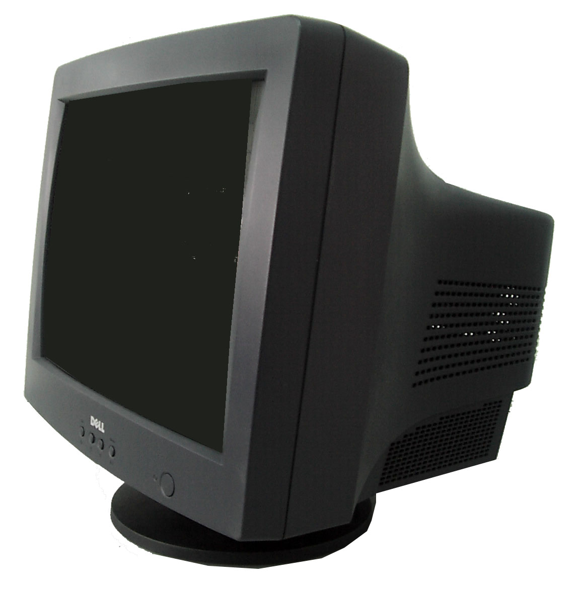

!SLIDE center
# LED Monitors #

!SLIDE subsection
# Who remembers this #

!SLIDE center

!SLIDE bullets incremental
# CRT #

* Cathode Ray Tube
* Entered commercially in 1934 in Germany

!SLIDE bullets incremental
# How it works #

* Contains vaccuum tube with electron guns
* One electron gun for each primary color (r,g,b)
* Steering coils focus the electron beams onto dots
* Electrons fired onto a fluorescant screen
* Light is generated from electrons hitting phosphor coating

!SLIDE center

!SLIDE subsection
# CRT on the way out #

!SLIDE

The _New York Times_ reports that, with sales of flat-screen televisions taking over the share of all TVs sold much faster than expected, the day is coming when you cannot buy a good old-fashioned, cheap, back-breaking tube television for hernias or money

**JAMES PONIEWOZIK**, [Time](http://entertainment.time.com/2006/08/08/crt_tv_rip_or_why_you_may_soon/)

!SLIDE bullets incremental
# Enter LCD #

* Liquid Crystal Display
* Liquid crystals discovered in 1888
* Worldwide sales of LCD TVs exceeded CRTs in 2008

!SLIDE center
# LCD in a nutshell #

* Whereas CRTs generate light, LCDs manipulate light
* Optical system makes the light even across the back of the screen
* Two sheets of polarizing material
* When light hits the first sheet, it is polarized
* Liquid crystals act as shutters, allowing/blocking light

!SLIDE
# Achieving Color/Transistors #

* Screen contains red, green, and blue subsections
* Subsections make up a pixel
* Adjusting the electrodes behind subpixels makes color
* Each subpixel has a transistor that controls it
* Transistor allows screen to be updated row by row

!SLIDE center
# Benefits of LCD #

* Thinner
* Use less power

!SLIDE subsection
# And finally, LED #

!SLIDE center transition=scrollUp
# LED vs LCD #

* Light-emitting diode
* The difference is in the backlight

!SLIDE center bullets
# LED Backlighting #

* LEDs use LED backlighting instead of cold cathode fluorescent
* The benefits:
  * Faster Turn On
  * More Neutral Colors
  * Brighter
  * Thinner
  * Longer-Lasting
  * Lower power consumption
  * Better heat dissipation

!SLIDE small
# Environment #

Arsenic and mercury are industry standard materials used in liquid crystal displays (LCDs). Arsenic is added during the manufacturing of the high performance glass used in LCDs to prevent the formation of defects, and the fluorescent lamps used to illuminate LCDs contain minute amounts of mercury. Apple is on track to introduce our first displays using arsenic-free glass in 2007. A small number of high performance integrated circuits (ICs) will continue to contain a minute amount of arsenic as an element of the semiconductor substrate.

To eliminate mercury in our displays, we need to transition from fluorescent lamps to light-emitting diodes (LEDs) to illuminate the displays. Fortunately, all iPod displays already use LEDs for illumination, and therefore contain no mercury. We plan to introduce our first Macs with LED backlight technology in 2007. Our ability to completely eliminate fluorescent lamps in all of our displays depends on how fast the LCD industry can transition to LED backlighting for larger displays.

Apple plans to completely eliminate the use of arsenic in all of its displays by the end of 2008.

Apple plans to reduce and eventually eliminate the use of mercury by transitioning to LED backlighting for all displays when technically and economically feasible.

(See [DOE Energy Efficiency and Renewable Energy](http://apps1.eere.energy.gov/buildings/publications/pdfs/ssl/2012_LED_Lifecycle_Report.pdf) for more info on environmental impact of LED)

!SLIDE subsection transition=fade
# What next #

!SLIDE bullets incremental
# Pixels Per Inch (PPI) #

* Higher PPI means a more seamless image
* CRT circa 2000 range from 67 to 130 PPI
* Amazon Kindle Fire has 169 PPI
* iPhone 4s has 326ppi
* 15in MacBook Pro (Retina display) has 220ppi
* 1080p on a 42" screen has 52ppi

!SLIDE
# "Retina" display #

* Achieving high pixel density so the eye doesn't notice pixelation
* Is subconscious
* How many iPhone 4/4s owners now look at older iPhone screens and notice a difference?

!SLIDE bullets incremental
# Max sensitivity #

* The human eye can generally not differentiate detail beyond 300 PPI
* Distance is a factor

!SLIDE center small
# Varying opinions #

* Disputing Apple's claims after announcing the Retina display in the iPhone 4, Raymond Soneira, president of DisplayMate Technologies stated that the resolution of the human retina is higher than claimed by Apple, working out to 477 ppi at 12 inches (305 mm) from the eyes, or 36 arcseconds per pixel
* Discover Magazine blogger Phil Plait, who previously worked on the Hubble Telescope, sided with Apple by noting that Soneira's math assumes perfect eyesight, whereas the average person would be unable to distinguish the iPhone's pixels at a distance of a foot.

!SLIDE bullets
# Downsides of max sensitivity #

* More power consumption
* More power leads to more heat

!SLIDE center small
# Fun, relevant update #

On the heels of a rumor that Apple is readying a minor update of the iPad ahead of the holiday season, an unverified report from the same publication claims that Apple is interested in returning to a one-LED backlight module solution instead of the two-LED design used in the current iPad.

DigiTimes claimed on Friday that Apple was making the revisions to reduce the heat output of the iPad.

"The extra LED is reportedly adding to overheating and that using one LED will help solve overheating issues since more backlights along with more power to heat those backlights is causing overheating," the report read.

!SLIDE center
# Thanks #