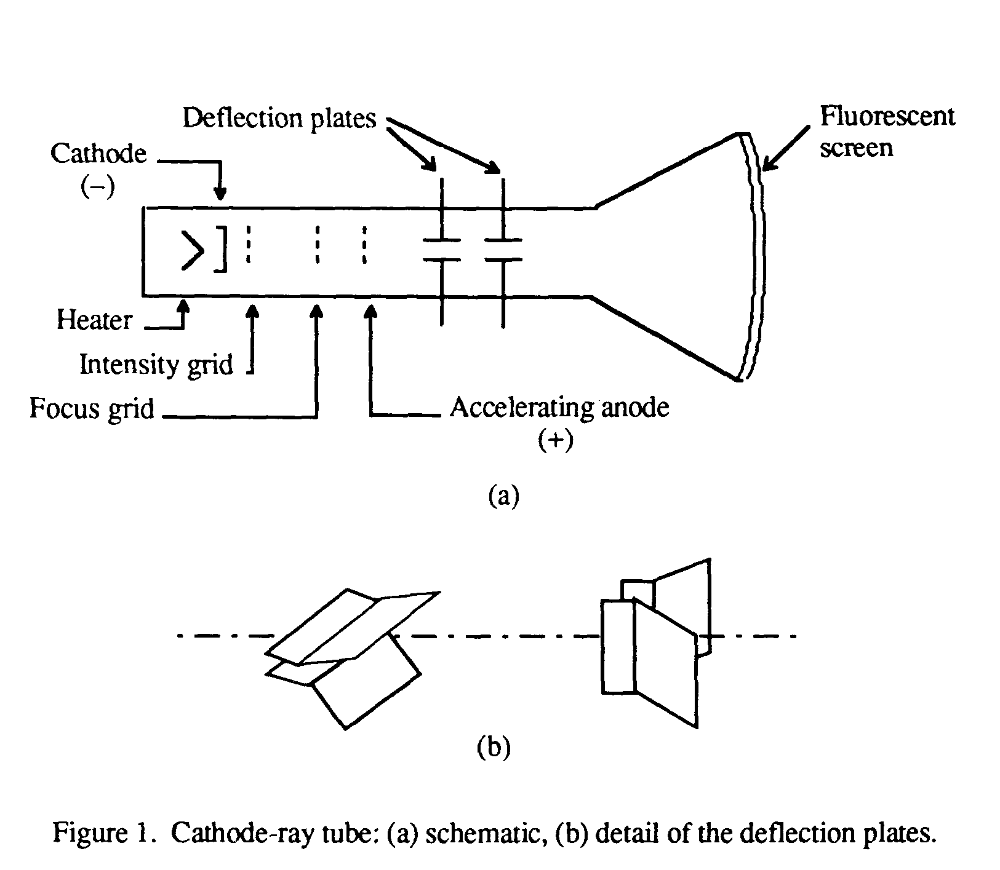

!SLIDE center
# L.E.D Monitors #

!SLIDE subsection
# Flashback #

!SLIDE bullets incremental
# CRT #

* Cathode Ray Tube
* Entered commercially in 1934 in Germany
* Vaccuum tube with an electron gun
* Electrons fired onto a fluorescant screen

!SLIDE full-page

!SLIDE bullets incremental
# How it works #

* Moving an electron beam back and forth across the back of the screen. 
* Each time the beam makes a pass across the screen, it lights up phosphor dots on the inside of the glass tube, thereby illuminating the active portions of the screen.
* By drawing many such lines from the top to the bottom of the screen, it creates an entire screen of images

!SLIDE subsection
# Just one(*) problem #

!SLIDE center transition=uncover
# HEAVY #

!SLIDE bullets incremental
# Enter LCD #

!SLIDE center
# LCD in a nutshell #

* LCD displays use two sheets of polarizing material with a liquid crystal solution between them
* An electric current passed through the liquid causes the crystals to align so that light cannot pass through them.
* Each crystal, therefore, is like a shutter, either allowing light to pass through or blocking the light.
* Color LCD displays use two basic techniques for producing color: Passive matrix is the less expensive of the two technologies. 
* The other technology, called thin film transistor (TFT) or active-matrix, produces color images that are as sharp as traditional CRT displays, but the technology is expensive

!SLIDE
# Matrix #

* LED matrix three pixel subsets
* Electronics of grid controls which pixel is activated
* RGB spectrum

!SLIDE subsection
# And finally, LED #

!SLIDE center transition=scrollUp
# LED vs LCD #

* The difference is in the backlight

!SLIDE center bullets
# LED Backlighting #

* LEDs use LED backlighting instead of the cold cathode fluorescent (CCFL) backlighting used in most other LCDs
* The benefits: 
  * Faster Turn On: LEDs can reach maximum brightness faster than CCFLs, in fact almost instantly.
  * More Neutral Colors: CCFLs are known to give a warm/yellowish tint. LEDs have a more neutral whitepoint.
  * Brighter: LEDs are brighter generally than CCFLs, thus allowing a display to achieve even higher maximum brightness.
  * Thinner: The reason LEDs are coming into prominence is that it was driven by the notebook sectors - LED back-lighting can be made thinner than CCFL back-lighting.
  * Longer-Lasting: Apparently, LEDs are rated for more life than CCFLs. Also the degradation over time is less severe than CCFLs.

!SLIDE center
# More benefits #

* thinner panel
* lower power consumption
* better heat dissipation
* a brighter display
* and better contrast levels

!SLIDE subsection transition=fade
# What next #

!SLIDE
# Retina display #

* Just how small can the grid get
* Is subconscious

!SLIDE bullets incremental
# DPI #

* Dots per square inch
* Higher DPI --> a more seamless image

!SLIDE bullets incremental
# Max sensitivity #

* each log file may be handled daily, weekly, monthly, or when it grows too large

!SLIDE bullets
# Downsides of max sensitivity #

* More power consumption
* More power leads to more heat